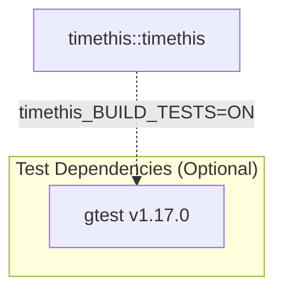

# TimeThis

<!-- badges -->
[](https://dev.azure.com/siddiqsoft/siddiqsoft/_build/latest?definitionId=11&branchName=main)
[](https://www.nuget.org/packages/SiddiqSoft.TimeThis/)
[](https://www.nuget.org/packages/SiddiqSoft.TimeThis/)
[](https://dev.azure.com/siddiqsoft/siddiqsoft/_build/latest?definitionId=11&branchName=main)
[](https://en.cppreference.com/w/cpp/23)
[](LICENSE)
<!-- end badges -->

**`timethis`** is a lightweight, header-only Modern C++23 stopwatch utility for measuring code execution time with optional callbacks.

---

## Documentation

**[siddiqsoft.github.io/timethis](https://siddiqsoft.github.io/timethis/)**

* [**Quick Start & Integration**](https://siddiqsoft.github.io/timethis/quickstart/)
* [**API Reference**](https://siddiqsoft.github.io/timethis/api/)
* [**Maintainer Guide**](https://siddiqsoft.github.io/timethis/maintainers/pipelines/)

---

## Features

- **RAII-Based Timing**: Automatically measures elapsed time from construction to destruction.
- **Optional Callbacks**: Execute a function with the elapsed duration on scope exit.
- **`std::format` Support**: Native formatter specialization for C++20/C++23 `std::format`.
- **Source Location Tracking**: Automatically captures where the timer was created via `std::source_location`.
- **Stream Output**: Direct output stream integration via `operator<<`.
- **Header-Only C++23**: No library linkage required, just include and use.
- **Single Ownership**: Deleted copy/move operations prevent accidental misuse.

---

## Quick Example

### Basic Timing

```cpp
#include <iostream>
#include "siddiqsoft/timethis.hpp"

int main()
{
    siddiqsoft::timethis timer;
    // ... do work ...
    std::cout << "Elapsed: " << timer.lap() << " us\n";
    return 0;
}
```

### With Callback

```cpp
#include <iostream>
#include <chrono>
#include "siddiqsoft/timethis.hpp"

void process()
{
    siddiqsoft::timethis timer([](const auto& duration) {
        auto ms = std::chrono::duration_cast<std::chrono::milliseconds>(duration);
        std::cout << "Operation took " << ms.count() << " ms\n";
    });
    // ... do work ...
} // Callback invoked on scope exit
```

### With `std::format`

```cpp
#include <iostream>
#include <format>
#include "siddiqsoft/timethis.hpp"

siddiqsoft::timethis timer;
// ... do work ...
std::cout << std::format("{}\n", timer);
```

### Stream Output

```cpp
siddiqsoft::timethis timer;
// ... do work ...
std::cout << timer << std::endl;  // Outputs: <function_name> took <elapsed>ns
```

---

## Installation

### CMake (CPM)

```cmake
include(CPM.cmake)
cpmaddpackage("gh:SiddiqSoft/TimeThis#2.5.0")
target_link_libraries(myapp PRIVATE timethis::timethis)
```

### CMake (FetchContent)

```cmake
include(FetchContent)
FetchContent_Declare(
    timethis
    GIT_REPOSITORY https://github.com/SiddiqSoft/TimeThis.git
    GIT_TAG        v2.5.0
)
FetchContent_MakeAvailable(timethis)
target_link_libraries(myapp PRIVATE timethis::timethis)
```

### NuGet (Windows / Visual Studio)

```powershell
Install-Package SiddiqSoft.TimeThis
```

---

## Dependencies



See [dependencies.md](dependencies.md) for detailed SBOM breakdown.

---

## License

Licensed under the [BSD 3-Clause License](LICENSE).
