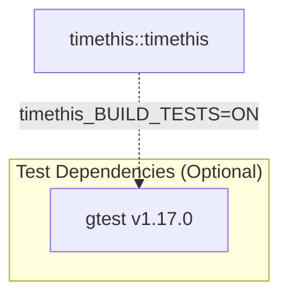

# Project Dependencies

This document is automatically generated from `CMakeLists.txt` files for `timethis`.

## Dependency Diagram

## Dependency Breakdown

| Dependency | Repository / Target | Version | Type | Scope / Platform |
| :--- | :--- | :--- | :--- | :--- |
| **gtest** | [`google/googletest`](https://github.com/google/googletest) | v1.17.0 | `CPM` | Test Target Only (`timethis_BUILD_TESTS=ON`) |
