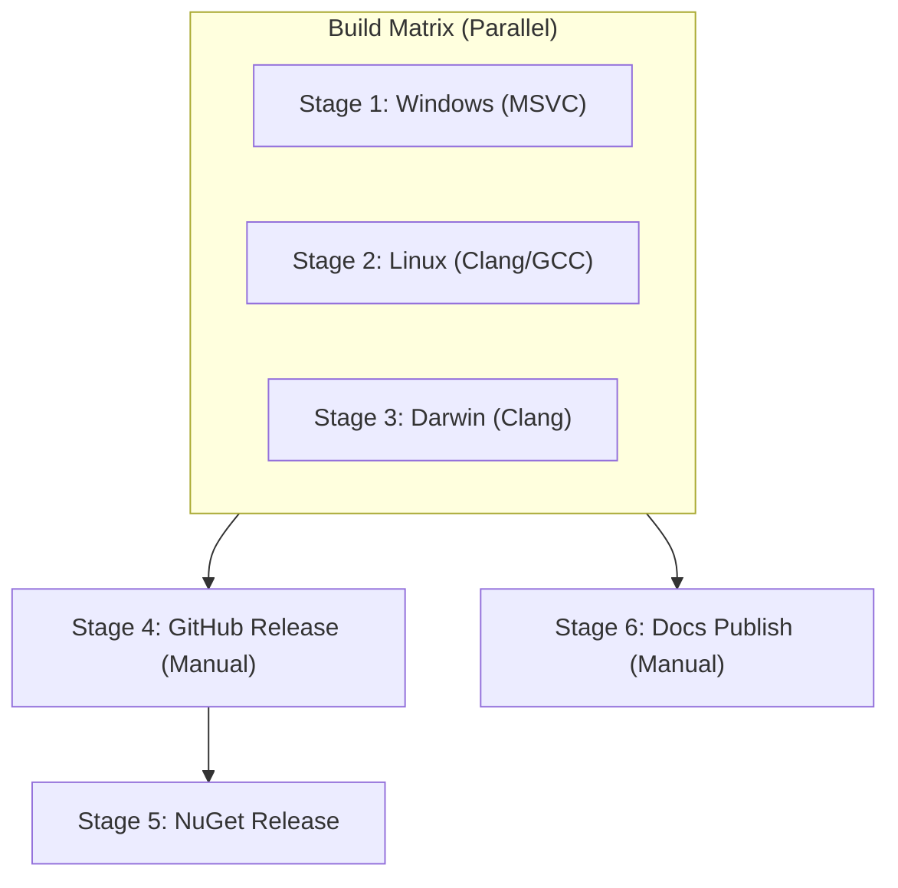

# CI/CD & Presets Architecture

## Matrix Architecture

The build pipeline spans 3 platforms executing in parallel across independent runner machines:

## CMake Presets Matrix

Defined in `CMakePresets.json` and customized via `project-base.json`:

| Preset | Host OS | Compiler | Architecture | Build Type |
| :--- | :--- | :--- | :--- | :--- |
| `Windows-x64-Release` | Windows | MSVC (`cl.exe`) | `x64` | Release |
| `Windows-x64-Debug` | Windows | MSVC (`cl.exe`) | `x64` | Debug |
| `Windows-arm64-Release` | Windows | MSVC (`cl.exe`) | `arm64` | Release |
| `Windows-arm64-Debug` | Windows | MSVC (`cl.exe`) | `arm64` | Debug |
| `Linux-Clang-Release` | Linux | `clang++` | `x64` / `arm64` | Release |
| `Linux-Clang-Debug` | Linux | `clang++` | `x64` / `arm64` | Debug |
| `Linux-GCC-Release` | Linux | `g++` | `x64` / `arm64` | Release |
| `Linux-GCC-Debug` | Linux | `g++` | `x64` / `arm64` | Debug |
| `Darwin-Clang-Release` | macOS | AppleClang | `arm64` | Release |
| `Darwin-Clang-Debug` | macOS | AppleClang | `arm64` | Debug |

## GitVersion & Semantic Versioning

Semantic Versioning is controlled by `GitVersion.yml`.

| Bump Type | Commit Message Tag |
| :--- | :--- |
| Major | `+semver: major` or `+semver: breaking` |
| Minor | `+semver: minor` or `+semver: feature` |
| Patch | `+semver: patch` or `+semver: fix` |
| Skip | `+semver: skip` or `+semver: none` |
